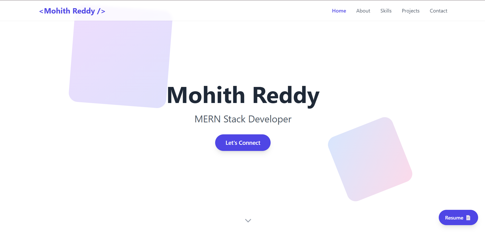
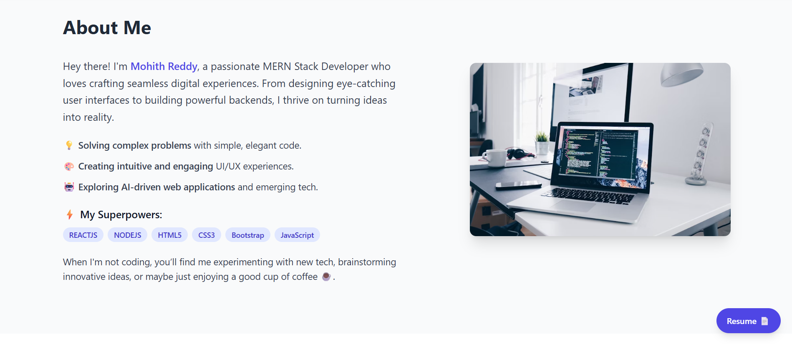
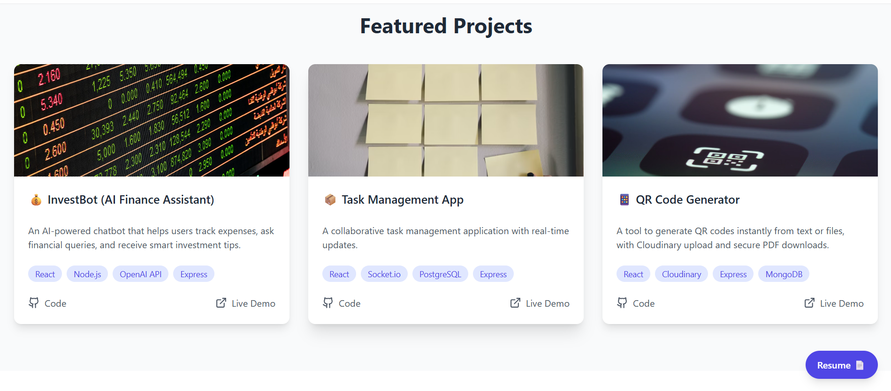
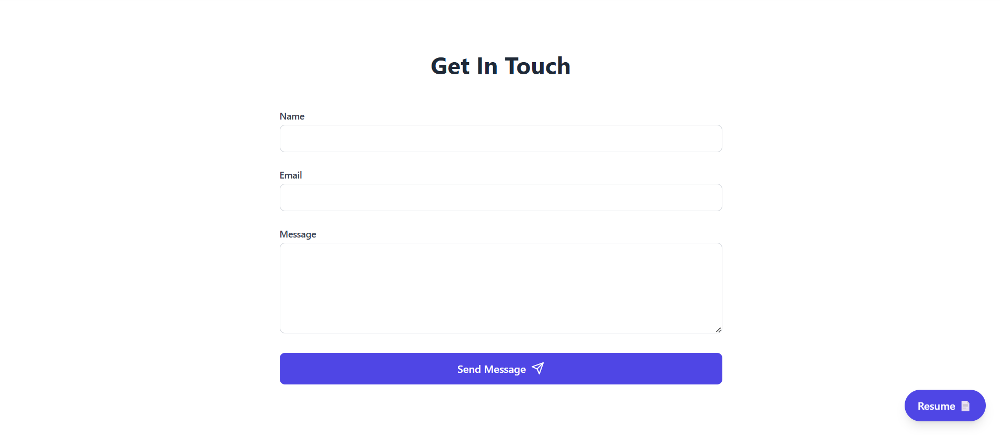

# 💼 Mohith Reddy's Portfolio

Welcome to my personal portfolio website — a showcase of my skills, projects, and developer journey. Built using React and **TypeScript**, this portfolio reflects my passion for creating performant, responsive, and elegant web applications.

## 🌐 Live Demo

👉 [Visit Portfolio](https://portfolio-mohith-reddys-projects-d7edca38.vercel.app)

## 🛠 Tech Stack

- **Frontend**: React, TypeScript
- **Styling**: CSS Modules / Custom CSS
- **Animations**: AOS (Animate On Scroll)
- **Hosting**: Vercel

## ✨ Features

- 🚀 Smooth scroll and animation effects
- 📱 Fully responsive design across devices
- 💡 Section-based layout (Home, About, Skills, Projects, Contact)
- 📄 Resume download button
- 🔗 Social media and GitHub links
- 📬 Functional contact form (static/dynamic)

## 📂 Folder Structure

