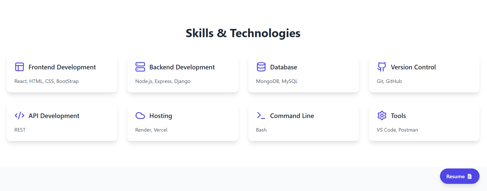

# 💼 Mohith Reddy's Portfolio

Welcome to my personal portfolio website — a showcase of my skills, projects, and developer journey. Built using **React** and **TypeScript**, this portfolio reflects my passion for creating performant, responsive, and elegant web applications.

## 🌐 Live Demo

👉 [Visit Portfolio](https://portfolio-mohith-reddys-projects-d7edca38.vercel.app)

**Home Page**

**About Page**

**Skills Page**

**Projects Page**

**Contact Page**


## ⚙️ Tech Stack

- **Framework**: [React](https://reactjs.org/)
- **Language**: [TypeScript](https://www.typescriptlang.org/)
- **Styling**: [Tailwind CSS](https://tailwindcss.com/)
- **Animations**: AOS (Animate on Scroll), 3D cube animation
- **Build Tool**: [Vite](https://vitejs.dev/)
- **Deployment**: [Vercel](https://vercel.com/)

## ✨ Features

- 🚀 Smooth scroll and animation effects
- 📱 Fully responsive design across devices
- 💡 Section-based layout (Home, About, Skills, Projects, Contact)
- 📄 Resume download button
- 🔗 Social media and GitHub links
- 📬 Functional contact form (static/dynamic)

## 📂 Folder Structure

```bash
src/
├── assets/ # Images and other media assets
├── components/
│ ├── sections/ # Main sections of the portfolio
│ │ ├── About.tsx
│ │ ├── Contact.tsx
│ │ ├── Home.tsx
│ │ ├── Projects.tsx
│ │ ├── Skills.tsx
│ ├── AnimatedCube.tsx # 3D rotating cube component
│ ├── Navbar.tsx # Top navigation bar
├── App.tsx # Main application component
├── index.css # Global styles (Tailwind)
├── main.tsx # ReactDOM render entry
```

---

## 🧠 Why I Built This

I wanted a centralized, beautiful place to share my work, tech stack, and achievements. This project helped me:

- Improve my TypeScript + React workflow
- Practice with Tailwind for scalable UI
- Integrate animation libraries for UI enhancement
- Polish my deployment and hosting skills

---

## 📸 Screenshots

You can find more screenshots in the `screenshots/` folder.  
Make sure to add:

- `home.png`
- `projects.png`
- `contact.png`

These are referenced in this README above.

---

## 🚀 Getting Started

### 1. Clone the Repository

```bash
git clone https://github.com/your-username/your-portfolio.git
cd your-portfolio
```

### 2. Install Dependencies

```bash
npm install
```

### 3. Run Locally

```bash
npm run dev
```

## 🛠 Upcoming Improvements
- Add dark mode support
- Connect EmailJS to make contact form functional
- Add project filtering or tags
- Add blog/articles section

🙋‍♂️ Author
Mohith Reddy
- 🔗 [Visit Portfolio](https://portfolio-mohith-reddys-projects-d7edca38.vercel.app)
- 🐙 [Visit GitHub](https://github.com/Mohith-Creator/))
- 📧 smohithreddy000@gmail.com

